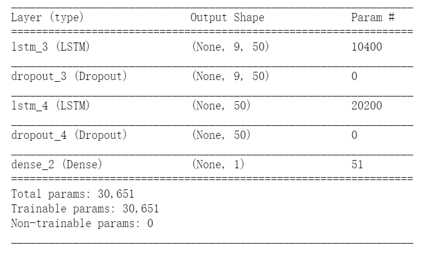
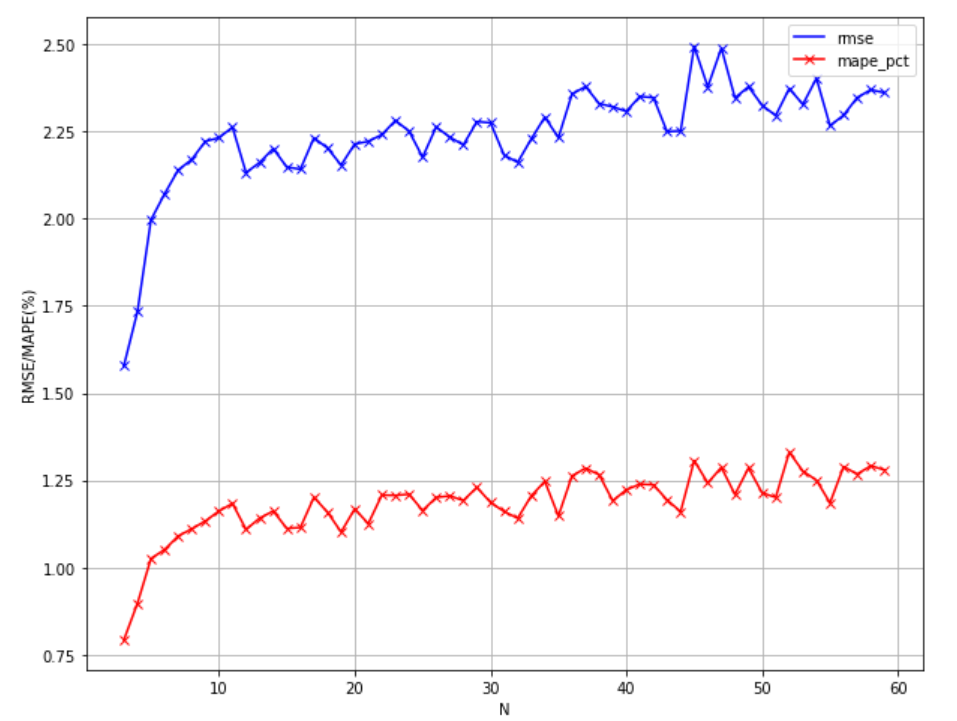
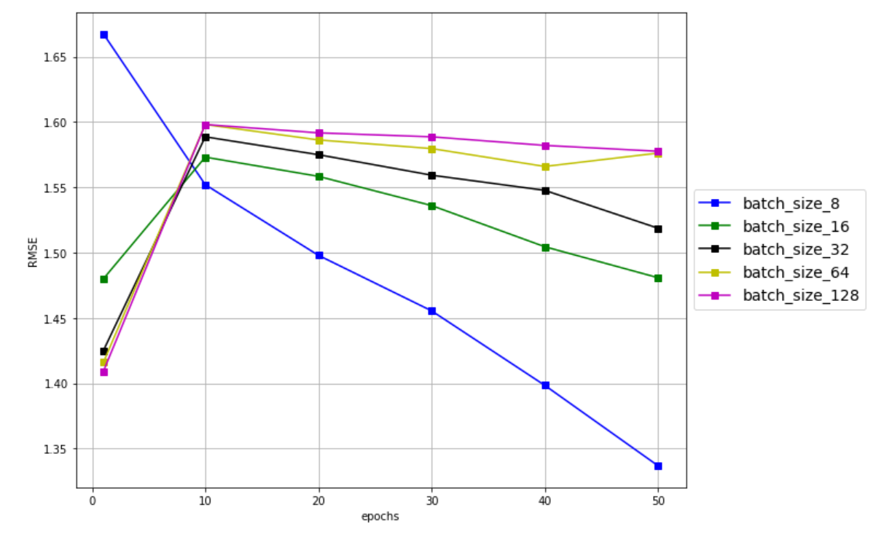
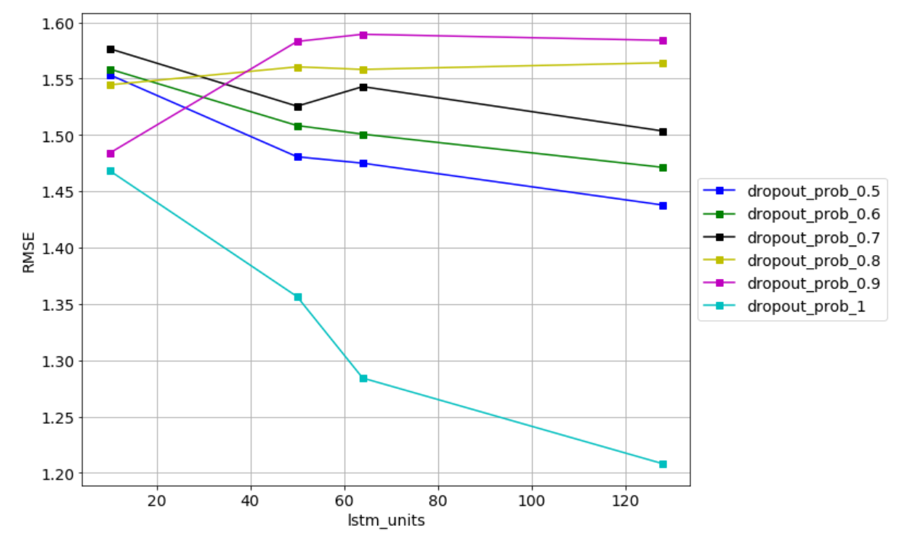
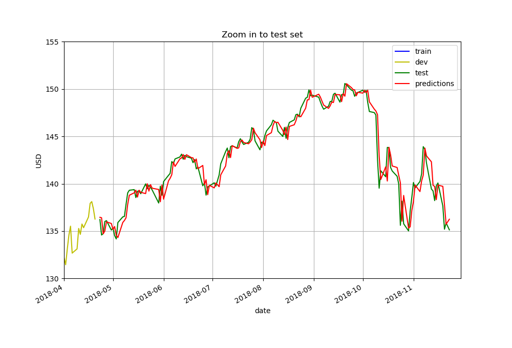

Assignment1
==
# 1、Abstract
The goal of this project is to predict the price of the subject matter based on the LSTM deep learning model.
# 2、Reference material
1、《基于LSTM的比特币价格预测模型（系列1）》
2、《预测股市崩盘基于统计机器学习与神经网络》
3、《严谨解决5种机器学习算法在预测股价的应用》
# 3、Research process
## 1、Data acquisition
According to the requirements in reference 1, I obtain the price data of the three trading pairs described in the information through the API of coin exchange. The specific code can be seen in 'data_get' file.In the process of writing the code, we found the base in the security API document base_url（https://api.binance.com ）unable to link. After consulting the information, we change the URL to（https://api.binancezh.cc ）successfully solved the link problem.
## 2、Create and adjust LSTM model
Since we can't find the ccryptolibrary in material 1, we use tensorflow described in material 2 to build the LSTM model，the library version used in this project is tensorflow==1.9.0，keras==2.2.0。
Then, according to the research in data 3, the daily adjusted closing price of vanguard total stock market ETF (VTI) is used as the research object, and the historical price of VTI from November 25, 2015 to November 23, 2018 is used to divide the data set into 60% training set, 20% verification set and 20% test set. The training set is used to train the model, the verification set is used to adjust the super parameters of the model, and the test set is used to test the performance of the model.
### (1)Using the first 60% data to train LSTM, the following basic models are obtained

### (2)Determine the best parameter N

We can get that when N = 3, RMSE is the smallest, so N_optimal=3
### (3)Determine the best parameter epochs and batch size

optimum epochs = 50
optimum batch_size = 8
RMSE is the smallest now
### (4)确定最佳参数LSTM units and dropout prob

optimum lstm_units = 128
optimum dropout_prob = 1.0
RMSE is the smallest now
### (5)确定最佳optimizer
Best optimizer is nadam，RMSE is the smallest

## 3、最终LSTM模型及test结果
N=3,epochs=50,batch_size=8,lstm_units=128,dropput_prob=1.0,optimizer='nadam'

RMSE on test set = 1.164
MAPE on test set = 0.583%

